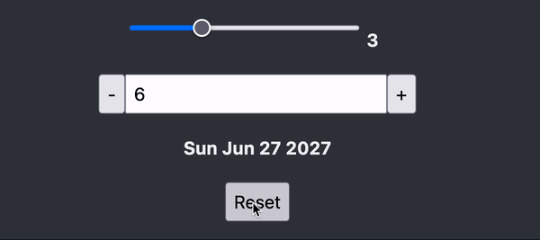

# DateCounter

## Table of contents

- [✅ Project completed Repo](#project-completed-repo)
- [⌛️ Project starter Repo](#project-starter-repo)
- [🎯 Learning goal](#learning-goal)
- [🔍 Code walkthrough](#code-walkthrough)
  - [App component](#app-component)
    - [App component](#app-component)
    - [The useReducer Hook](#the-usereducer-hook)
    - [Managing related piece of state](#managing-related-pieces-of-state)
    - [Summary](#summary)

## Project completed repo

- check out the code here `->` [completed](https://github.com/hermkan/react-part-I-projects/tree/main/01-components-props-jsx/completed)

## Project starter repo

- check out the code here `->` [starter](https://github.com/hermkan/react-part-I-projects/tree/main/01-components-props-jsx/starter)

## Learning Goal

Understand the mechanics of the `useReducer()` hook.

## Code walkthrough

### App Component

In the **src/** folder :

- **app.jsx** returns one component called `DateCounter`. We will be working on this component

#### The useReducer hook

The useReducer hook works with a function called `reducer`.
It is a pure function that takes two arguments :

1. The previous state
2. The action

and returns the next state.

```jsx
function reducer(state, action) {
  console.log(`state: ${state}`, `action: ${action}`)
}

export function DateCounter() {
  const [count, dispatch] = useReducer(reducer, 0)
}
```

First, we defined a function called `reducer` that takes two parameters `state` and `action`. Inside the body of the function we're printing the state and the action to the console.

Inside `DateCounter` we called `useReducer` which is a React Hook that lets you add the `reducer` function to your component.

`useReducer` takes three parameters :

1. `reducer`: The reducer function that specifies how the state gets updated. It must be pure, should take the state and action as arguments, and should return the next state. State and action can be of any types.

2. `initialArg`: The value from which the initial state is calculated. It can be a value of any type.

3. **optional** `init`: The initializer function that should return the initial state. If it’s not specified, the initial state is set to initialArg. Otherwise, the initial state is set to the result of calling init(initialArg)

`useReducer` returns an array with exactly two values :

1. The current state. During the first render, it’s set to `init(initialArg)` or `initialArg` (if there’s no `init`).

2. The `dispatch` function that lets you update the state to a different value and trigger a re-render.

Let's call the `dispatch` function with `1` as an argument inside the `increment` function.

```jsx
function reducer(state, action) {
  console.log(`state: ${state}`, `action: ${action}`)
}

export function DateCounter() {
 ...
}
const inc = function () {
   dispatch(1)
}
```

In the browser, we should get this output :


We can see that the state is `0` and the action is `1`. This is because the `reducer` function get access to the current state which is `0` :

```jsx
export function DateCounter() {
  const [count, dispatch] = useReducer(reducer, 0)
}
```

and the `action`, which is the argument passed to the `dispatch` function :

```jsx
const inc = function () {
  dispatch(1)
}
```

As mentionned above, the `reducer` takes the state and action as arguments, and return the next state.

Let's try this :

```jsx
function reducer(state, action) {
  console.log(`state: ${state}`, `action: ${action}`)
  return state + action
}
...
```

When we clicked on the increment button, the counter was updated :


As we can see the reducer calculates the new state based on the action it receives.
The state was `0` and the action received was `1`, `0 + 1 = 1`, therefore `1` is rendered on the screen.

Let's make our counter more useful.

The dispatch function returned by `useReducer` lets you update the state to a different value and trigger a re-render.

An `action` is usually a plain JavaScript object that represents an intention to change the state. Action objects usually have a `type` property with a user-defined string value that describes the action being taken. Optional properties can be added to the action object. One common property added is conventionally called `payload`, which is used to supply data necessary to perform the desired action.

In our example, we can define three actions:

1. Increment the counter
2. Decrement the counter
3. Setting the counter

Let's implement `increment`, `decrement` and `setCount`. It's very common to use a [switch statement](https://developer.mozilla.org/en-US/docs/Web/JavaScript/Reference/Statements/switch) to define the reducer logic :

```jsx
function reducer(state, action) {
  switch (action.type) {
    case 'increment':
      return state + 1
    case 'decrement':
      return state - 1
    case 'setCount':
      return action.payload
    default:
      throw new Error('Invalid action')
  }
}
export function DateCounter() {
  ...

 const inc = function () {
    dispatch({ type: 'increment' })
  }
  const dec = function () {
    dispatch({ type: 'decrement' })
  }

  const defineCount = function (e) {
    dispatch({ type: 'setCount', payload: Number(e.target.value) })
  }
}
```

The counter should works as intended.

Let's recap what happened here :

- The `useReducer` hook takes two parameters : the `reducer` function and the `initialState` which is `0` in our example.

- The `reducer` function takes the current state and the action that we passed to the `dispatch` function and calculates the next state. In our example:
  - when the action is `increment`, we increase the current state by `1`.
  - when the action is `decrement`, we decrease the current state by `1`.
  - when the action is `setCount`, we set the counter to the number entered by the user, which is saved in the `payload` property.


#### Managing related pieces of state

The useReducer hook is commonly used to manage complex state.
It provides a centralized container for state that is shared across your entire application, with rules ensuring that the state can only be updated in a predictable fashion using events called `actions`.

For our component DateCounter, we have two pieces of state :

1. step
2. count

Let' put them in a separate object called `initialState` :

```jsx
const initialState = {
  step: 1,
  count: 0,
}
```

and pass `initialState` to the useReducer() hook :

```jsx
const [state, dispatch] = useReducer(reducer, initialState)
```

We can also immediately destructure `initialState` :

```jsx
const { count, step } = state
```

Now back to our reducer function, as mentionned above, reducers must follow certain rules:

1. They should only calculate the new state value based on the state and action arguments

2. They are not allowed to modify the existing state. Instead, they must make immutable updates, by copying the existing state and making changes to the copied values.

3. They must not do any asynchronous logic or other “side effects”

These rules help improve useReducer’s scaleable and predictable state management. Some common behaviors to avoid inside reducers are network requests, generating random numbers, and using asynchronous functions.

We can update the reducer function like so :

```jsx
function reducer(state, action) {
  switch (action.type) {
    case 'increment':
      return { ...state, count: state.count + 1 }
    case 'decrement':
      return { ...state, count: state.count - 1 }
    case 'setCount':
      return { ...state, count: action.payload }
    default:
      throw new Error('Invalid action')
  }
}
```

The counter still works exactly like before :


To comply with the second rule (performing an immutable update ) the `initialState` object’s contents was copied into a new object and only this copy is mutated. In Javascript, we can use the [spread operator](https://developer.mozilla.org/en-US/docs/Web/JavaScript/Reference/Operators/Spread_syntax) to obtain copies of objects and arrays.

Next, let's try and implement the `step` feature.
We want to be able to choose the number of steps our counter will increment or decrement.
With our new reducer implementation, it's very easy:

- Inside `defineStep()` event handler we can dispatch an action called `step` to capture the number of steps we will increment or decrement using the **event object**. the **value** will be saved in the `payload` property. We should also convert the **value** to a number using **Number()**:

```js
const defineStep = function (e) {
  dispatch({ type: 'step', payload: Number(e.target.value) })
}
```

- Then, we can create a new case in our reducer function to handle this action (event):

```js
function reducer(state, action) {
...
 case 'step':
      return { ...state, step: action.payload }
...
}
```

- and finally, using the current `step` state, we can increase or decrease the counter :

```js
function reducer(state, action) {
...
 case 'increment':
      return { ...state, count: state.count + state.step }
    case 'decrement':
      return { ...state, count: state.count - state.step }
...
}
```


The last feature to implement is `reset`. We want to be able to reset the counter to `0` and the number of steps to `1` :

- we can accomplish this by dispatching an action called `reset` inside `reset()` event handler :

```js
const reset = function () {
  dispatch({ type: 'reset' })
}
```

- In our reducer, if a `reset` action is dispatched, we want to return the `initialState`

```js
const initialState = {
  step: 1,
  count: 0,
}
function reducer(state, action) {
...
 case 'reset':
      return initialState
...
}
```

Let's reset our counter :



#### Summary

To recap :

- Why should we use the `useReducer()` hook? :

In certain situations when state management with `useState` is not enough. For example :

1. when components have a lots of state variables and state updates spread across many event handlers all over the component or multiple components

2. when multiple state updates needs to happen simultaneously (our `reset` feature for example, we need to update the `step` and the `count` state simutaneously).

3. when updating one piece of state depends on one or multiple other piece of states.

For all these scenarios, you should consider using the `useReducer` hook.

- How does `useReducer()` hook work? :

1. We call `useReducer()` with a reducer function and it's initial state. It returns a `state` and a `dispatch` function:

```jsx
const [state, dispatch] = useReducer(reducer, initialState)
```

2. The initial state should contain related pieces of state and is usually stored in a plain javascript object:

```jsx
const initialState = {
  step: 1,
  count: 0,
}
```

3. The `reducer()` function is the central place where all the state's changes happen. Moving state updates from the event handlers to this central place, allows us to **decouple the state's update logic from the component** which makes our application easier to understand. In practice, it is a pure function that **takes two arguments**: the current state and an object representing an `action` performed by the user and **returns the next state** :

```jsx
function reducer(state, action) {
  switch (action.type) {
    case 'increment':
      return { ...state, count: state.count + state.step }
   ...
    case 'reset':
      return initialState
    default:
      throw new Error('Invalid action')
  }
}
```

- How do we trigger a state update? :

This is where the `dispatch()` function comes in. The dispatch function sends actions from the event handlers to the reducer. This function takes one argument: the `action` object that describes how to update the state. Action objects usually have a `type` property with a string value that describes the action being taken and an optional property called `payload` that stores data needed to perform the state update:

```jsx
dispatch({ type: 'step', payload: Number(e.target.value) })
```

Let's take a look at the example below:


- In an event handler, we call the dispatch function that was returned by `useReducer()` in order to dispatch an action to a reducer.

- The action contains information about how to update the state. In our diagram, the `type` is **updateDay** and the `payload` is **23**, which means that, we want to set the `date` state to **23**.

- The reducer takes the action and the current state and returns **the next state**

- And finally, as always, state updates trigger a component's **re-render**.
