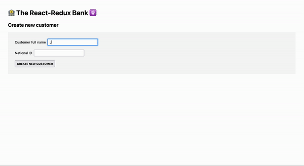
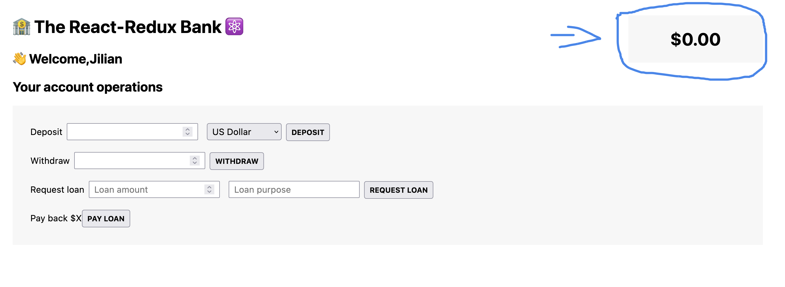
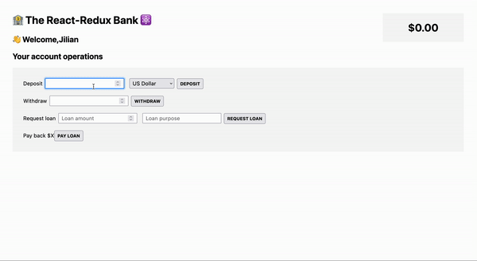
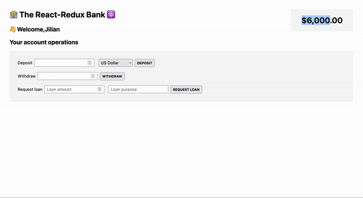
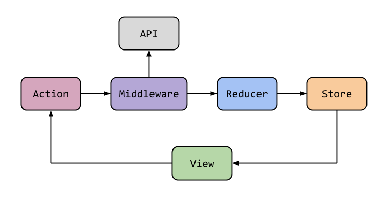
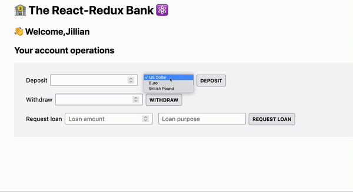

# Redux and redux toolkit

## Screenshots


## Table of contents

- [About redux](#about-redux)
- [Bank account application](#the-bank-account-application)

## About Redux

⚠️ _disclaimer_:

You need to have a solid understanding of the **useReducer** hook in order to understand Redux.

Checkout the [useReducer](http://github.com/usereducerproject) section first!

### _What is Redux?_

Redux is :

- 3rd party library to manage **global state**
- **Standalone** library, but easy to integrate with react apps using react-redux library
- (The big idea is) All global state is stored in **one globally accessible store**, which is easy to update using **actions** (like `useReducer`)
- conceptually similar to using **Context API** + **useReducer** (When global store is updated, consuming components re-rerender).

#### _Do you need to learn redux?_

Historically redux was used in most react apps for all global state. Today, there are many alternatives, most react apps **don't need redux anymore** unless they need to **manage global UI state** more efficiently.

#### _Why is it included here?_

Some applications do require _Redux_ (or a similar library).

The ideal use case for _Redux_ (or a similar library) is when **there's a lot global UI state that update frequently**. UI state is simply data about the UI itself (not remote state which involves communication with an API).
For global remote state, there are many others options, the most popular being **react-query** library.

### _How does Redux works?_

_Quick useReducer recap:_

To update state with **useReducer** :

- We dispatch an **action** in an **event handler**
- This action is plain javascript object describes how to update the state. Action objects usually have a **type** property with a string value that describes the action being taken and an optional property called **payload** that stores data needed to perform the state update.

```js
const deposit = function () {
  dispatch({ type: 'deposit', payload: 200 })
}
```

- The action is dispatched to a **reducer** function. The reducer takes the action and the **current state** and returns the **next state**.

- As the states updates, the component re-render

This mechanism is quite similar to Redux but with two main differences :

1. With **Redux**, we dispatch actions to the **store** :

The store is a **centralized container** where all **global state** lives. It's the **single source of truth** of all global state across the entire application.

This store is also where one or multiple reducers live. The reason why there are multiple reducers is because it's **recommended to create one reducer per feature**. For example, in an _e-commerce_ application you can have a reducer for the _shopping cart(1)_, another one for _handling user data(2)_ and another one for the _theme(3)_ etc..

Any component that consume data from the store will re-render when the state updates.

2. With redux actions are created using functions called **actions creators** in order to automate the process. The main benefit of this approach is that all possible actions are centralized in one place which reduces bugs (This is a convention not a must).

_Recap:_

In order to update global state with redux :

- We start by **calling an action creator** in a component and then **dispatch the action in a store**

- The action **will be picked up by the right reducer** and **update the state accordingly**

- This state update **triggers a re-render**

## The bank account application

### A Simple model of the application

#### Creating the reducer

In order to understand Redux in isolation (without react), in the **components/Store.jsx** file, we are going to model a simple version of the bank account application with 3 pieces of state :

- A balance
- A Loan
- A loan purpose

In the **components/Store.jsx** file :

- we can create the initial state object :

```jsx
const initalState = {
  balance: 0,
  loan: 0,
  loanPurpose: '',
}
```

- we can also create the reducer function :

```jsx
function reducer(state = initalState, action) {
  switch (action.type) {
    case 'account/deposit':
      return {
        ...state,
        balance: state.balance + action.payload,
      }
    case 'account/withdraw':
      return {
        ...state,
        balance: state.balance - action.payload,
      }
    case 'account/requestLoan':
      if (state.loan > 0) return
      return {
        ...state,
        loan: action.payload.amount,
        loanPurpose: action.payload.purpose,
        balance: state.balance + action.payload.amount,
      }
    case 'account/payLoan':
      return {
        ...state,
        loan: 0,
        loanPurpose: '',
        balance: state.balance - state.loan,
      }

    default:
      return state
  }
}
```

Notice how :

- We set `initialState` object as the value to the state parameter if no value or `undefined` is passed.

- Each `case` follow a `specific pattern` recommended by the redux team : `state domain/event name`

- We're making `immutable updates`. We're not modify the existing state, but instead, we making copying of the existing state and making changes to the copied values.

- In the `account/requestLoan`, we're checking first if a loan hasn't been granted yet. If the loan balance is negative we can grant a loan otherwise, we don't.

- In the `default case`, we're not throwing an exception but just returning the `initial state`. This is a recommendation from the redux team.

With the reducer in place, it's time to create our `store`.

#### Creating the store

In Redux, a store is a container (a plain javascript object) that manages the global state of your application.

As the single source of truth, the store is the center of every Redux application. It has the ability to update the global state and subscribes elements of an application’s UI to changes in the state.

We will focus on creating a basic Redux application with the `createStore()` method from the Redux API. In order to create the store, we need to install `redux` first.
In the command line, we can run this commmand :

```sh
npm install redux
```

Redux exports a valuable helper function for creating this store object called `createStore()`. The `createStore()` helper function has a single argument, a reducer function.

In the **components/Store.jsx** file, we can import the `createStore()` helper function from the `redux` library:

```jsx
import { createStore } from 'redux'
```

To create a store with our reducer, we can write:

```jsx
const store = createStore(reducer)
```

#### Dispatching Actions to the Store

The store object returned by `createStore()` provides a number of useful methods for interacting with its state as well as the reducer function it was created with.

The most commonly used method are :

- store.getState()
- store.dispatch(action)
- store.subscribe(listener)

`store.dispatch()`, can be used to dispatch an action to the store, indicating that you wish to update the state. Its only argument is an `action` object, which must have a `type` property describing the desired state change.
For example :

```jsx
store.dispatch({ type: 'account/deposit', payload: 500 })
```

Assuming that the `action.type` is recognized by the reducer, the state will be updated and returned.

Let’s see how this works :

```jsx
console.log(store.getState())
store.dispatch({ type: 'account/deposit', payload: 500 })
console.log(store.getState())
```

In this example, you can also see another store method, `store.getState()`, which returns the current value of the store’s state. Printing its value between each dispatched action allows us to see how the store’s state changes:


Internally, when the store executes its reducer, it uses `store.getState()` as the state argument. Though you won’t see it, you can imagine that when an action is dispatched like this…

```jsx
store.dispatch({ type: 'account/deposit', payload: 500 })
```

…the store calls the reducer like this:

```jsx
reducer(store.getState(), { type: 'account/deposit', payload: 500 })
```

#### Action Creators

As you saw in the last exercise, you are likely to dispatch actions of the same type multiple times or from multiple places. Typing out the entire action object can be tedious and creates opportunities to make an error.

For example, you might write:

```jsx
store.dispatch({ type: 'acout/Deposit', payload: 500 })
store.dispatch({ type: 'Account/deposit', payload: 100 })
store.dispatch({ type: 'account/depoit', payload: 1200 })
```

In most Redux applications, `action creators` are used to reduce this repetition and to provide consistency. An `action creator` is simply a function that returns an `action` object with a `type` property. They are typically called and passed directly to the `store.dispatch()`method, resulting in fewer errors and an easier-to-read dispatch statement.

The above code could be rewritten using an `action creator` called `deposit()` like so:

```jsx
const deposit = (amount) => {
  return { type: 'account/deposit', payload: amount }
}
store.dispatch(deposit(500)) // deposit 500'
store.dispatch(deposit(100)) // deposit 100'
store.dispatch(deposit(1200)) // deposit 1200'
```

Though not necessary in a Redux application, action creators save us the time needed to type out the entire action object, reduce the chances of making a typo, and improve the readability of our application.

In our application, we are going to create one action creator for each possible actions :

```jsx
function deposit(amount) {
  return { type: 'account/deposit', payload: amount }
}
function withdraw(amount) {
  return { type: 'account/withdraw', payload: amount }
}
function requestLoan(amount, purpose) {
  return { type: 'account/requestLoan', payload: { amount, purpose } }
}
function payLoan() {
  return { type: 'account/payLoan' }
}
```

#### Adding more state

Redux really shines when used in applications with many features and a lot of data, where having a centralized store to keep it all organized is advantageous.
One of the functionnalities of our application is managing user information.
We need to redesign the state's structure in order to implement this functionnality.

In the **components/Store.jsx** file, let's refactor our code to include an account state and a customer state. We could rename `initialState`, `initialStateAccount` and create a new object for the customer state named `initialStateCustomer` with these properties :

- id
- fullName
- createdAt

```jsx
const initalStateAccount = {...}
const initalStateCustomer = {
  id: '',
  fullName: '',
  createdAt: '',
}
```

let's also define action creators to create a new customer like this...

```jsx
function createCustomer(fullName, id) {
  return {
    type: 'customer/createCustomer', // Notice how the state domain has changed.
    payload: { fullName, id, createdAt: new Date().toISOString() },
  }
}
```

…and to update the customer's name like this:

```jsx
function updateName(fullName) {
  return {
    type: 'customer/updateName',
    payload: fullName,
  }
}
```

As the application state becomes increasingly more complex, managing it all with a single reducer will become impractical.

The solution is to follow a pattern called `reducer composition`. In this pattern, individual reducers are responsible for updating only one state domain (slice of the application’s state), and their results are recombined by a so called `rootReducer` to form a single state object.

Let's try and implement this in our application:

We'll start by renaming our reducer function `accountReducer` because it only deals with the account state...

```jsx
function accountReducer(state = initalStateAccount, action) {...}
```

...create the customer reducer

```jsx
function customerReducer(state = initalStateCustomer, action) {
  switch (action.type) {
    case 'customer/createCustomer':
      return { ...state, ...action.payload }
    case 'customer/updateName':
      return { ...state, fullName: action.payload }
    default:
      return state
  }
}
```

... finally combine the reducers using a helper function from the redux library called `combineReducers()` and pass `rootReducer` to `createStore()` :

```jsx
const rootReducer = combineReducers({
  account: accountReducer,
  customer: customerReducer,
})

const store = createStore(rootReducer)
```

The `combineReducers()` helper function accepts an object and returns a single `root` reducer. The name of keys of the input object is optional and the values are the reducers.

Let's dispatch the action called `customer/createCustomer` to the store :

```jsx
console.log(store.getState())
store.dispatch(store.dispatch(createCustomer('Jillian', nanoid()))) // we're using the tiny string ID generator for JavaScript, Nanoid.
console.log(store.getState())
```

we can confirm that it still works by printing its value between each dispatched :

.

#### Reorganizing the files structure

Like many improvements in the world, you sometimes have to break the process to make it better.
If we take a look at Our code, the actions creators, the reducers and the store are all in one file which is not a good pattern. Let's reorganize our file structure to improve the readability of our application. We are going to organize our application into features :

- Account features
- Customer features

In the **src/** folder, we created a folder called **features/**.
Inside **features/**, we created two subfolders **account/** and **customer/**.

We've also moved :

- `AccountOperations.jsx`
- `BalanceDisplay.jsx`

into **features/account**

and :

- `AccountOperations.jsx`
- `BalanceDisplay.jsx`

into **features/customer**

In a Redux application, the state domains are also known as `slices`. Each slice typically represents a different feature of the entire application. We have two state domains : account and customer.

As a best practice, we're also going to create a separate file for each slice of our application...

- accountSlice.jsx
- customerSlice.jsx

...where we will have

1. the initial state,
2. the action creators,
3. the reducers,

`accountSlice.jsx` should look like this..

```jsx
// INITIAL STATE
const initalStateAccount = {
  balance: 0,
  loan: 0,
  loanPurpose: '',
}
// ACTION CREATORS
export function deposit(amount) {
  return { type: 'account/deposit', payload: amount }
}
export function withdraw(amount) {
  return { type: 'account/withdraw', payload: amount }
}
export function requestLoan(amount, purpose) {
  return { type: 'account/requestLoan', payload: { amount, purpose } }
}
export function payLoan() {
  return { type: 'account/payLoan' }
}

// REDUCER
export default function accountReducer(state = initalStateAccount, action) {...}
```

... `customerSlice.jsx` like this :

```jsx
// INITIAL STATE
const initalStateCustomer = {
  id: '',
  fullName: '',
  createdAt: '',
}
// ACTION CREATORS
export function createCustomer(fullName, id) {
  return {
    type: 'customer/createCustomer',
    payload: { fullName, id, createdAt: new Date().toISOString() },
  }
}
export function updateName(fullName) {
  return {
    type: 'customer/updateName',
    payload: fullName,
  }
}
// REDUCER
export default function customerReducer(state = initalStateCustomer, action) {...}
```

... and finally `store.jsx` :

```jsx
import { combineReducers, createStore } from 'redux'
import customerReducer from './features/customer/customerSlice'
import accountReducer from './features/account/accountSlice'

const rootReducer = combineReducers({
  account: accountReducer,
  customer: customerReducer,
})

const store = createStore(rootReducer)
export default store
```

#### Connect the Redux Store to our UI

Up until now, our focus was understanding Redux in isolation (without react).Let’s change that! It's now time to connect the Redux Store to our UI.

Redux and React can be used together to create a highly interactive application. Although we’ll be using React, Redux is not just limited to React; it can be used within the context of any UI framework. Nevertheless, Redux is most commonly paired with React.

The `react-redux package` is the official Redux-UI binding package for React. It allows your React components to interact with a Redux store without writing the interaction logic yourself. This allows an application to rely on Redux to manage the global state and React to render the UI based on the state.

Interactions may include :

- reading data from a Redux store
- and dispatching actions to the store

let's install the package using the following command:

```sh
npm install react-redux
```

Connecting a Redux store with react requires a few consistent steps :
in **src/main.jsx** we will :

- import the store from **store.jsx**

```jsx
import store from './Store.jsx'
```

- import the `Provider` from the `react-redux package`

```jsx
import { Provider } from 'react-redux'
```

- wrap the `<Provider>` component around the top-level component `<App/>` and pass the store through the `<Provider>` component’s store prop:

```jsx
root.render(
  <React.StrictMode>
    <Provider store={store}>
      <App />
    </Provider>
  </React.StrictMode>
)
```

#### Selectors and the useSelector() Hook

With the 3 steps above, we have successully connected the Redux Store to react!
The Redux store is provided to the React components of the application using the `<Provider>` component. This means that every single component can read data from the store and dispatch actions to the store.

Let's try it out!

In order to read data from the store, we use the so called `selector functions` in combination with the `useSelector()` hook. Selector functions are not provided by the `react-redux` library but instead are user-defined. The `useSelector()` hook is provided by the `react-redux` library.

A selector function, or selector, is a pure function that selects data from the Redux store’s state. Each component in an application that needs access to some data will have one or more selectors that extract only the necessary data for that component.

When called within a React component `useSelector(selector)` accomplishes two things:

- Returns the data retrieved by the selector
- Subscribes the React component to changes in the store and forces a re-render if the selector’s result changes

in the `Customer.jsx` component :

- we will import `useSelector()` from 'react-redux'

```jsx
import { useSelector } from 'react-redux'
```

- Selectors can be used inline or with a pre-defined selector function. In this example, we will use the `useSelector()` with an inline selector function. The selector function accepts the store as argument and returns the data retrieved by the selector

```jsx
//within the component defintion
const customerName = useSelector((store) => store.customer.fullName)
console.log(customerName)

// In the return statement

return <h2>👋 Welcome,{customerName}</h2>
```

Printing the variable `customerName` allows us to see the customer's name in the store. At the moment, it's only an empty string. In order to display the customer's name we need to learn how to dispacth an action.

#### The useDispatch() Hook

We are going to look at the final step: dispatching actions. With `react-redux` we can dispatch actions with the `useDispatch()` hook.

In the `CreateCustomer.jsx` component :

- we will import `useDispatch()` from 'react-redux'

```jsx
import { useDispatch } from 'react-redux'
```

- in the `handleClick()` event handler, dispatch an action like so :

```jsx
//within the component defintion
const [fullName, setFullName] = useState('')
const [id, setId] = useState('')
const dispatch = useDispatch()
function handleClick() {
  dispatch(createCustomer(fullName, id))
}
```

Notice how we called `useDispatch()` to obtain a reference to the Redux store `dispatch()` function and assigns it to `dispatch` and dispatched an action using `dispatch()` with an action creators as the argument.
With this setup, if we fill out the form `Create new customer` and click on the button `Create new customer`, the customer's name will be displayed:


In `app.jsx`, let's use our newfound knowledge to conditionnally render `<Customer />`, `<AccountOperations />` and `<BalanceDisplay />`:

- If there's a customer's name in the the store we should display `<Customer />`, `<AccountOperations />` and `<BalanceDisplay />`
- If not then we should only display `<CreateCustomer />`

the first step would be to read the customer's name from the store, we can use `useSelector()` to accomplish this..

```jsx
//within the component defintion
const fullName = useSelector((state) => state.customer.fullName)
```

...and then use the ternary operator to conditionnally render the components :

```jsx
//in the return statement

{
  !fullName ? (
    <CreateCustomer />
  ) : (
    <>
      <Customer />
      <AccountOperations />
      <BalanceDisplay />
    </>
  )
}
```

The result :



To keep practicing dispatching actions, let's work on the `<AccountOperations />` component.
`<AccountOperations />` responsibility is to allow the user to make different operations in his account such as :

- Making Deposit
- Withdrawing money
- Requesting a loan
- Paying a loan off

We've created 4 event handlers where we are going to dispatch these actions :

- handleDeposit()
- handleWithdrawal()
- handleRequestLoan()
- handlePayLoan()

The first step is to be able to read the balance from the store.
In `<BalanceDisplay/>` component we could write :

```jsx
// within the component definition
const balance = useSelector((state) => state.account.balance)
// in the return statement
return <div className="balance">{formatCurrency(balance)}</div>
```

The balance should be `0`



Back in `<AccountOperations />`, inside `handleDeposit()`, we can dispatch an action with `useDispatch()`

```jsx
import { useDispatch } from 'react-redux'
import { deposit } from './accountSlice'

// within the component definition
const [depositAmount, setDepositAmount] = useState('')
...
const dispatch = useDispatch()

function handleDeposit() {
    if (!depositAmount) return
    dispatch(deposit(depositAmount))
    setDepositAmount('')
  }
```

Notice how we :

- Imported useDispatch from `react-redux` and deposit (the action creator) from `accountSlice`.
- Created a state variable that holds a reference to the amount enter by the user
- Created a dispatch variable that holds the reference to the Redux store dispatch function
- Wrote an `if statement` which is a safe guard to prevent errors (deposit `$0` for example)
- Dispatching an action using `dispatch()` with `deposit()`, which accepts the amount entered by the user saved in `depositAmount`.
- reset `depositAmount` state variable back to it's initial value

When you run the application you should be able to make deposit in the account.



We will repeat the same process for `handleWithdrawal()`, `handleRequestLoan()`, `handlePayLoan()`, but first let's make sure we're able to display the loan amount and the loan purpose.
using `useSelector()` we're going to extract the `balance`, `loan` and `loanPurpose` from the store

```jsx
// within the component definition
const {
  balance,
  loan,
  loanPurpose: currentLoanPurpose,
} = useSelector((store) => store.account)
```

In the return statement we could write the following, to conditionnally render the request loan section and display the loan and loan purpose. We only want to display this section if the user requests a loan :

```jsx
// in the return statement
{
  loan > 0 && (
    <div>
      <span>
        Pay back ${loan} ({currentLoanPurpose})
      </span>
      <button onClick={handlePayLoan}>Pay loan</button>
    </div>
  )
}
```

and now our event handlers :

```jsx
function handleWithdrawal() {
  if (!withdrawalAmount || withdrawalAmount > balance) return // prevent withdrawing an amount greater than the available balance
  dispatch(withdraw(withdrawalAmount))
  setWithdrawalAmount('')
}

function handleRequestLoan() {
  if (!loanAmount || !loanPurpose) return
  dispatch(requestLoan(loanAmount, loanPurpose))
  setLoanAmount('')
  setLoanPurpose('')
}

function handlePayLoan() {
  dispatch(payLoan())
}
```

We should be able to withdraw, request a loan and pay it back.



#### Middleware and Thunks

Let's continue our journey learning redux with `Middleware` and `Thunks`.
We haven’t covered one of the most common challenges in app development: **making asynchronous requests**.

One of the functionnalities of our application is to **allow users to deposit money in a foreign currency** which will then be converted in U.S dollars by calling an external API.

This is where `Redux-thunk` comes in. The idea is that we will have a middleware that's sitting between dispatching the action as the user clicks on the `deposit` button and that action when it's passed along to the the reducer.



_What is Redux Middleware?_

As the name suggests, `middleware` is the code that runs in the middle—usually between a framework receiving a request and producing a response.

In `Redux`, `middleware` runs between when an action is dispatched and when that action is passed along to the reducer. `Middleware` intercepts actions after they are dispatched and before they are passed along to the reducer.

Some common tasks that middleware performs include logging, caching, adding auth tokens to request headers, crash reporting, routing, and making asynchronous requests for data.

_How to make API call with redux thunks?_

- The first thing to do is is to install redux thunk :

```sh
npm i redux-thunk
```

- You’ll need to import it from redux-thunk like so:

```jsx
import thunk from 'redux-thunk'
```

- We will also import `applyMiddleware()` helper function from 'redux' library and pass it as the second argument to `createStore()`. Also, we will pass `thunk` to `applyMiddleware()` :

```jsx
import { applyMiddleware,... } from 'redux'

const store = createStore(rootReducer, applyMiddleware(thunk))

```

- In the **features/account/accountSlice.jsx** file and **features/account/AccountOperation.jsx** , we will add a second argument `currency` to `deposit()`

```jsx
//features/account/accountSlice.jsx
export function deposit(amount, currency) {
 ...
}

//features/account/AccountOperations.jsx
  function handleDeposit() {
    ...
    dispatch(deposit(depositAmount, currency))
   ...
    setCurrency('')
  }
```

- back **features/account/accountSlice.jsx**, we will modify our `deposit()` action creator like so :

```jsx
export function deposit(amount, currency) {
  if (currency === 'USD') return { type: 'account/deposit', payload: amount }
  return async function (dispatch, getState) {
    // API call
    const response = await fetch(
      `https://api.frankfurter.app/latest?amount=${amount}&from=${currency}&to=USD`
    )
    const data = await response.json()
    const convertedInUSD = data.rates.USD

    // return action
    dispatch({ type: 'account/deposit', payload: convertedInUSD })
  }
}
```

There are a few things worth highlighting here :

1. We have an `if statement` to check whether the amount deposited is in U.S dollars or not. If it is, we will return the same action as before otherwise we make an API call to convert it in USD.

2. That function is an anonymous function that takes two parameters, `dispatch` and `getState`. Inside the function we call `fetch()`, and pass to it our endpoint constructed using template literals where `amount` and `currency` were replaced by the amount and the currency passed to `deposit()` as arguments.

3. The resposnse returned from the API is converted into `json` format and saved in the variable `data`

4. The response saved in `data` is an plain javascript object with many properties. But the most pertinent value for our application is saved in `data.rates.USD`, which we store in a variable called `convertedInUSD`.

5. Finally we dispatch the `'account/deposit'` action with the payload `convertedInUSD`.

With that in place, we should be able to deposit an amount in a foreign currency and see the converted result deposited into our account :



THe beauty of Middleware, is that the data fetching does not happen in the component `AccountOperations`. This component has no clue that an amount was converted behind the scenes. Everything is happening in a central place `accountSlice`.

#### Redux toolkit

Now, that we understand the fundamental concepts of `Redux`, it's time to switch gears and talk about the modern way of writing redux applications.

You’ve probably noticed that working with Redux can become quite verbose and complex. If you’re overwhelmed by all the moving parts and details to remember, you’re not alone.

Fortunately, the Redux team created Redux Toolkit to address these challenges!

_What is redux toolkit?_

Redux toolkit :

- is the **modern way and preferred way** of writing redux applications
- contains packages and functions tailored for constructing a Redux application.
- takes an **opinionated approach** that incorporates best practices, simplifies most Redux tasks, prevents common mistakes, and makes it easier to write Redux applications.
- allows us to write **a lot less code** to achieve the same result ('less boilerplate')

These are some of the benefits of Redux toolkit :

1. We can write code **mutates** state inside reducers (will be converted to immutable logic behind the scenes by a library called `Immer`).

2. Actions creators are **automatically** created

3. **automatic** setup of thunk middleware and Devtools.

To explore the full array of methods that Redux Toolkit offers, see the [Redux Toolkit docs](https://redux-toolkit.js.org/).

In order to use Redux toolkit, we can use this command to install the Redux Toolkit package :

```sh
npm install @reduxjs/toolkit
```

##### Converting the Store to Use `configureStore()`

In addition to simplifying the logic for actions and reducers, Redux Toolkit has a `configureStore()` method that simplifies the store setup process. `configureStore()` wraps around the Redux library’s `createStore()` method and the `combineReducers()` method, and handles most of the store set up for us automatically.

For example, we can refactor our **store.jsx** file like so :

```jsx
import { configureStore } from '@reduxjs/toolkit'
import customerReducer from './features/customer/customerSlice'
import accountReducer from './features/account/accountSlice'

const store = configureStore({
  reducer: {
    customerReducer,
    accountReducer,
  },
})
```

- We removed all the unecessary imports (thunk, applyMiddleware, combineReducers, createStore) because `configureStore()` set them up automatically

- `configureStore()` accepts a single configuration object parameter. The input object should have a reducer property that defines either a function to be used as the root reducer, or an object of slice reducers, which will be combined to create a root reducer. There are [many properties available in this object](https://redux-toolkit.js.org/api/configureStore), but for this application, just the reducer property will be sufficient.

Note all the work that this one call to `configureStore()` does for us:

1. `Reducer`: It combines customerReducer and accountReducer into the root reducer function, removing the need to call `combineReducers()`. This lowers the amount of boilerplate code we need to write.

_Previous code_ :

```jsx
const rootReducer = combineReducers({
  account: accountReducer,
  customer: customerReducer,
})
```

2. `Store`: It creates a Redux store using that root reducer, removing the need to call `createStore()`

_Previous code_ :

```jsx
const store = createStore(rootReducer)
```

3. Middleware: It automatically adds middleware to check for common mistakes like accidentally mutating the state. In the traditional manual way, we’d need to set this up ourselves

4. DevTools: It automatically sets up the Redux DevTools Extension connection. In the traditional manual way, we’d also need to set this up ourselves.

##### Refactoring with `createSlice()`

As a reminder, a `slice` of state is a segment of the global state that focuses on a particular feature.

In our example

- All the account operations are in the `accountSlice`.
- All the customer's operations are in the `customerSlice`.

Each slice encompasses the related data, along with its associated reducers, actions, and selectors. Think of it as a self-contained unit dedicated to managing a specific part of your application’s functionality.

Here’s what our code looked like for `accountSlice.jsx`:

```jsx
/* accountSlice.jsx  */
// INITIAL STATE
const initalStateAccount = {
  balance: 0,
  loan: 0,
  loanPurpose: '',
}

// ACTION CREATORS
export function deposit(amount, currency) {
  if (currency === 'USD') return { type: 'account/deposit', payload: amount }
  return async function (dispatch, getState) {
    // API call
    const response = await fetch(
      `https://api.frankfurter.app/latest?amount=${amount}&from=${currency}&to=USD`
    )
    const data = await response.json()
    const convertedInUSD = data.rates.USD

    // return action
    dispatch({ type: 'account/deposit', payload: convertedInUSD })
  }
}
export function withdraw(amount) {
  return { type: 'account/withdraw', payload: amount }
}
export function requestLoan(amount, purpose) {
  return { type: 'account/requestLoan', payload: { amount, purpose } }
}
export function payLoan() {
  return { type: 'account/payLoan' }
}

// REDUCER
export default function accountReducer(state = initalStateAccount, action) {
  switch (action.type) {
    case 'account/deposit':
      return {
        ...state,
        balance: state.balance + action.payload,
      }
    case 'account/withdraw':
      return {
        ...state,
        balance: state.balance - action.payload,
      }
    case 'account/requestLoan':
      if (state.loan > 0) return
      return {
        ...state,
        loan: action.payload.amount,
        loanPurpose: action.payload.purpose,
        balance: state.balance + action.payload.amount,
      }
    case 'account/payLoan':
      return {
        ...state,
        loan: 0,
        loanPurpose: '',
        balance: state.balance - state.loan,
      }

    default:
      return state
  }
}
```

There’s a lot of code written just to have some reducers and action creators.
`createSlice()` streamlines this process by generating all of these based on a single configuration object. `createSlice()` has **one parameter**, a configuration object. The object has the following properties:

- `name`: A string that identifies the name of the slice. `createSlice()` uses this to generate the action types and action creators.

- `initialState`: The initial state value for the reducer.

- `reducers`: An object where each key represents an action type, a string identifier for the action. The associated method, known as a “case reducer,” describes how the state should be updated when that action is triggered. These reducers function as sets of instructions, directing the state changes based on the type of action dispatched.

Let’s see this in action!

```jsx
import { createSlice } from '@reduxjs/toolkit'

const initialState = {
  balance: 0,
  loan: 0,
  loanPurpose: '',
}

const reducers = {
  //Reducer for "account/deposit" action
  deposit: (state, action) => {
    state.balance += action.payload
  },

  //Reducer for "account/withdraw" action
  withdraw: (state, action) => {
    state.balance -= action.payload
  },

  //Reducer for "account/requestLoan" action
  requestLoan: {
    prepare: (amount, purpose) => {
      return {
        payload: { amount, purpose },
      }
    },
    reducer: (state, action) => {
      if (state.loan > 0) return
      state.loan = action.payload.amount
      state.loanPurpose = action.payload.purpose
      state.balance += action.payload.amount
    },
  },

  //Reducer for "account/payLoan" action
  payLoan: (state, action) => {
    state.balance -= state.loan
    state.loanPurpose = ''
    state.loan = 0
  },
}

export function deposit(amount, currency) {
  if (currency === 'USD') return { type: 'account/deposit', payload: amount }
  return async function (dispatch, getState) {
    // API call
    const response = await fetch(
      `https://api.frankfurter.app/latest?amount=${amount}&from=${currency}&to=USD`
    )
    const data = await response.json()
    const convertedInUSD = data.rates.USD

    // return action
    dispatch({ type: 'account/deposit', payload: convertedInUSD })
  }
}
const options = {
  name: 'account', //Name of slice
  initialState,
  reducers,
}

const accountSlice = createSlice(options)

export const { withdraw, requestLoan, payLoan } = accountSlice.actions

export default accountSlice.reducer
```

`createSlice()` returns an object that looks like this:

```jsx
{
 name: 'account',
 reducer: (state, action) => newState,
 actions: {
   deposit: (payload) => ({type: 'todos/addTodo', payload}),
   withdraw: (payload) => ({type: 'todos/toggleTodo', payload})
   ...
 },
}
```

Let’s break this down:

- name: This holds a string used as the prefix for generated action types.
- reducer: This is the completed reducer function.
- actions: These are auto-generated action creators.

So, what do these auto-generated action objects look like?

By default, each action creator accepts one argument, which becomes the `action.payload.` The `action.type` string is formed by combining the slice’s name with the case reducer function’s name.

For instance:

```jsx
console.log(accountSlice.actions.withdraw(300))

// {type: 'account/withdraw', payload: 300}
```

With these auto-generated action creators, we can export them and use them in other files.
Following the Redux community’s [“ducks” pattern](https://redux.js.org/style-guide/style-guide#structure-files-as-feature-folders-or-ducks) , we suggest exporting named action creators separately from the reducer:

```jsx
export const { withdraw, requestLoan, payLoan } = accountSlice.actions
export default accountSlice.reducer
```

Once we export the action creators, we can use them to dispatch actions in a structured way throughout our application.

We can see here that using `createSlice()` drastically reduces the amount of boilerplate code you need to write!

_What about the reducers?_

Let’s now take a closer look at the reducer within the object returned by `createSlice()`.

`accountSlice.reducer` is the comprehensive reducer function that represents the collection of case reducers, each associated with different actions your slice is meant to handle. Effectively, it combines the case reducers into one. This is commonly referred to as the “`slice reducer.`”

When an action with the type '`account/withdraw`' is dispatched, `accountSlice` employs `accountSlice.reducer()` to check whether the dispatched action’s type aligns with any of the case reducers in `accountSlice.actions`. If a match is found, the matching case reducer function is executed; if not, the current state is returned. This mirrors the pattern we earlier employed with `switch/case` statements!

Once auto-generated, `accountSlice.reducer` needs to be exported so that it can be integrated into the global store and used as the account slice of state. Per [“ducks” pattern](https://redux.js.org/style-guide/style-guide#structure-files-as-feature-folders-or-ducks), we default export `accountSlice.reducer`

```jsx
export default accountSlice.reducer
```

With this in place, everything should work as before.

Let's do the same dance for our `customerSlice` :

```jsx
import { createSlice } from '@reduxjs/toolkit'

// INITIAL STATE
const initialState = {
  id: '',
  fullName: '',
  createdAt: '',
}

// REDUCERS

const reducers = {
  createCustomer: {
    prepare: (fullName, id) => {
      return {
        payload: {
          fullName,
          id,
          createdAt: new Date().toISOString(),
        },
      }
    },
    reducer: (state, action) => {
      state.id = action.payload.id
      state.fullName = action.payload.fullName
      state.createdAt = action.payload.createdAt
    },
  },
  updateName: (state, action) => {
    state.fullName = action.payload
  },
}

const options = {
  name: 'customer',
  initialState,
  reducers,
}

const customerSlice = createSlice(options)

export const { createCustomer, updateName } = customerSlice.actions
export default customerSlice.reducer
```

That is it for our small `Bank application`, we've learned a whole lot about Redux Toolkit and the essential methods to refactor and simplify existing Redux logic.

Recap :

- Redux Toolkit (RTK) contains packages and functions that build in suggested best practices, simplify most Redux tasks, prevent common mistakes, and make it easier to write Redux applications.

- RTK has a createSlice() function that will help us simplify our Redux reducer logic and actions.

- createSlice() has one parameter, a configuration object, which we call options. In this lesson, we covered three object properties: name, initialState, and reducers. The configuration object has more properties which will be covered in the following lessons.

- A case reducer is a method that can update the state and will be executed when the corresponding action type is dispatched. This is similar to a case in a switch statement.

- You can write code that “mutates” the state inside the case reducers passed to createSlice(), and Immer will safely and accurately return an immutably updated state.

- createSlice() returns an object with the following properties: name, reducer, actions, and caseReducers.

- We typically use a Redux community code convention called the “ducks” pattern when exporting the action creators and the reducer.

- RTK has a configureStore() function that simplifies the store setup process. configureStore() wraps around the Redux core createStore() function and the combineReducers() function, and handles most of the store setup for us automatically.

#### Comparing Redux to context API

- Context API + useReducer are already built into React whereas if you want to use Redux, you need to install more packages which will ultimately increase your bundle size

- It's quite easy to set up a single **context** with Context API + useReducer, however if you need additionnal state slice, it requires a new context **set up from scratch** which creates something called `provider hell`. Whereas with redux it demands a "lot" of work **initially** but once everything is set up, it's easy to **create additional state slices**

- When it comes to async operations the context API has no mechanism for that. Redux on the other hand has support for **middleware**.

- Optimizing can become a pain for context, while Redux comes with optimization tools **out of the box**

- Redux has it's own Devtools, while with Context, you have ot use the React DevTools.

_When to use Context API or REDUX?_

There is no right answer to that question because it depends on the type of project you're working on. But the general consensus is :

- Use context for global state management in **small** apps
- Use Redux for global state management in **large** apps
- Use the context when you need to share a value that does not change often (color theme, preferred language, auth user etc...)
- Use Redux When you have a lot of global UI state that needs to be updated frequently (shopping cart, current tabs, filters, search etc...)
- Redux is also great at handling **complex state** with nested objects and arrays
- Use Context when you have a simple prop drilling problem

In the next section, we will build even bigger applications to keep practicing our react and redux skills.

<!-- Using the `createAsyncThunk()` helper function.

`createAsyncThunk()` is a function with two parameters, an action type string, and an asynchronous callback, that generates a thunk action creator that will run the provided callback and automatically dispatch [promise]() lifecycle actions as appropriate so that you don’t have to dispatch pending/fulfilled/rejected actions by hand.

To use `createAsyncThunk()`, you’ll first need to import it from Redux Toolkit like so:

```jsx
import { createAsyncThunk } from '@reduxjs/toolkit'
```

Next, you’ll need to call createAsyncThunk(), passing two arguments :

- The first is a string representing the asynchronous action’s type. Conventionally, type strings take the form "resourceType/actionName". In this case, since we are getting an individual user by their id, our action type will be users/fetchUserById.

- The second argument to createAsyncThunk is the payload creator: an asynchronous function that returns a promise resolving to the result of an asynchronous operation. Here is fetchUserById rewritten using createAsyncThunk:

```jsx
import { createAsyncThunk } from '@reduxjs/toolkit'
import { fetchUser } from './api'
const fetchUserById = createAsyncThunk(
  'users/fetchUserById', // action type
  async (arg, thunkAPI) => {
    // payload creator
    const response = await fetchUser(arg)
    return response.json()
  }
)
```

There are a few things worth highlighting here :

- First, observe that the payload creator receives two arguments—arg and thunkAPI. We will elaborate on those in the next exercise.

- Second, note that the payload creator we provided doesn’t dispatch any actions at all. It just returns the result of an asynchronous operation.

As you can see, createAsyncThunk() makes defining thunk action creators concise. All you have to write is an asynchronous thunk function; createAsyncThunk() takes care of the rest, returning an action creator that will dispatch pending/fulfilled/rejected actions as appropriate.

_Passing Arguments to Thunks_

In the last exercise, we promised to elaborate on the two arguments that the payload creator (the asynchronous function we pass to createAsyncThunk) receives: arg and thunkAPI. The first argument, arg, will be equal to the first argument passed to the thunk action creator itself. For example, if we call fetchUserById(7), then inside the payload creator, arg will be equal to 7.

But what if you need to pass multiple arguments to your thunk? Since the payload creator only receives the first argument passed to the thunk action creator, you’ll want to bundle multiple arguments into a single object. For example, say we want to search our app’s users by first and last name. If the thunk action creator is called searchUsers, we would call it like this: searchUsers({firstName: 'Ada', lastName: 'Lovelace'}).

If you need to access these variables individually, you can use ES6 destructuring assignment to unpack the object when you declare the payload creator and pass it to createAsyncThunk, like this :

```jsx
const searchUsers = createAsyncThunk(
  'users/searchUsers',
  async ({ firstName, lastName }, thunkAPI) => {
    // perform the asynchronous search request here
  }
)
```

If your thunk requires no arguments, you can just call the action creator without it, and the arg argument will be undefined.

In the event the thunk requires only one param (for example, fetching a specific resource by id) you should name that first param semantically. Here’s the fetchUserById example from the last exercise, with the arg parameter semantically renamed to userId

```jsx
import { createAsyncThunk } from '@reduxjs/toolkit'
import { fetchUser } from './api'
const fetchUserById = createAsyncThunk(
  'users/fetchUserById', // action type
  async (userId, thunkAPI) => {
    // payload creator
    const response = await fetchUser(userId)
    return response.data
  }
)
```

The payload creator’s second argument, thunkAPI, is an object containing several useful methods, including the store’s dispatch and getState. For an exhaustive list of methods available in the thunkAPI object, you can read the documentation.

_Actions Generated by createAsyncThunk()_

s you know, createAsyncThunk takes care of dispatching actions for each of the promise lifecycle states: pending, fulfilled, and rejected. But what exactly do these actions look like?

Building off the action type string you pass to it, createAsyncThunk produces an action type for each promise lifecycle states. If you pass the action type string 'resourceType/actionType' to createAsyncThunk, it will produce these three action types:

    'resourceType/actionType/pending'
    'resourceType/actionType/fulfilled'
    'resourceType/actionType/rejected'

To use our earlier example:

```jsx
import { createAsyncThunk } from '@reduxjs/toolkit'
import { fetchUser } from './api'

const fetchUserById = createAsyncThunk(
  'users/fetchUserById', // action type
  async (userId, thunkAPI) => {
    // payload creator
    const response = await fetchUser(userId)
    return response.data
  }
)
```

When you pass createAsyncThunk the action type string 'users/fetchUserById', createAsyncThunk produces these three action types:

    'users/fetchUserById/pending'
    'users/fetchUserById/fulfilled'
    'users/fetchUserById/rejected'

If you need to access the individual pending/fulfilled/rejected action creators, you can reference them like this:

When you pass createAsyncThunk the action type string 'users/fetchUserById', createAsyncThunk produces these three action types:

    'users/fetchUserById/pending'
    'users/fetchUserById/fulfilled'
    'users/fetchUserById/rejected'

If you need to access the individual pending/fulfilled/rejected action creators, you can reference them like this: --> -->
