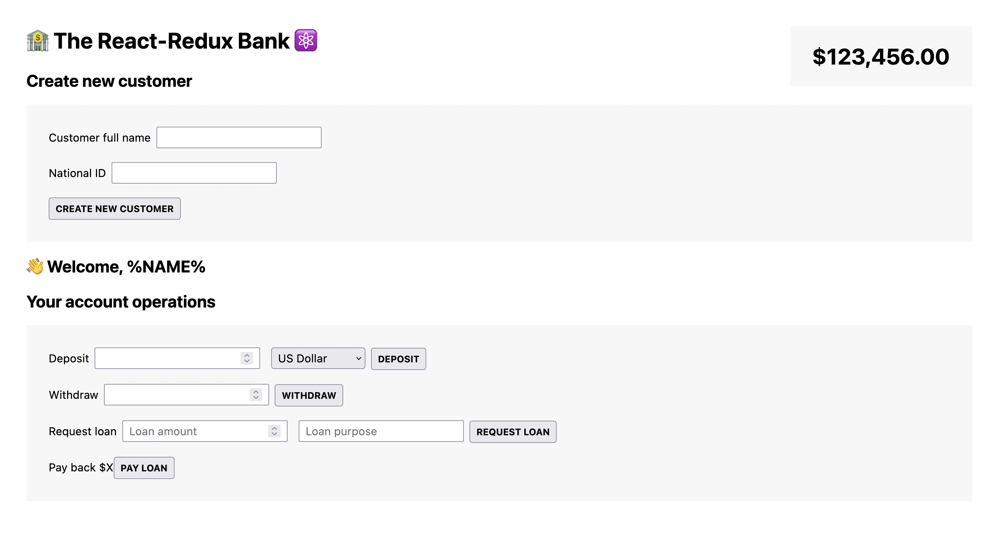
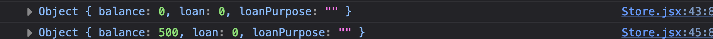
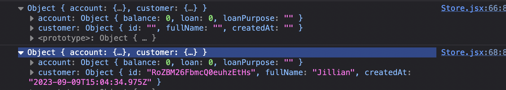
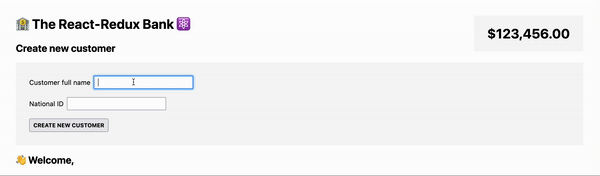

# Redux and redux toolkit

## Screenshots



## Table of contents

- [About redux](#about-redux)
- [Bank account application](#the-bank-account-application)

## About Redux

⚠️ _disclaimer_:

You need to have a solid understanding of the **useReducer** hook in order to understand Redux.

Checkout the [useReducer](http://github.com/usereducerproject) section first!

### _What is Redux?_

Redux is :

- 3rd party library to manage **global state**
- **Standalone** library, but easy to integrate with react apps using react-redux library
- (The big idea is) All global state is stored in **one globally accessible store**, which is easy to update using **actions** (like `useReducer`)
- conceptually similar to using **Context API** + **useReducer** (When global store is updated, consuming components re-rerender).

#### _Do you need to learn redux?_

Historically redux was used in most react apps for all global state. Today, there are many alternatives, most react apps **don't need redux anymore** unless they need to **manage global UI state** more efficiently.

#### _Why is it included here?_

Some applications do require _Redux_ (or a similar library).

The ideal use case for _Redux_ (or a similar library) is when **there's a lot global UI state that update frequently**. UI state is simply data about the UI itself (not remote state which involves communication with an API).
For global remote state, there are many others options, the most popular being **react-query** library.

### _How does Redux works?_

_Quick useReducer recap:_

To update state with **useReducer** :

- We dispatch an **action** in an **event handler**
- This action is plain javascript object describes how to update the state. Action objects usually have a **type** property with a string value that describes the action being taken and an optional property called **payload** that stores data needed to perform the state update.

```js
const deposit = function () {
  dispatch({ type: 'deposit', payload: 200 })
}
```

- The action is dispatched to a **reducer** function. The reducer takes the action and the **current state** and returns the **next state**.

- As the states updates, the component re-render

This mechanism is quite similar to Redux but with two main differences :

1. With **Redux**, we dispatch actions to the **store** :

The store is a **centralized container** where all **global state** lives. It's the **single source of truth** of all global state across the entire application.

This store is also where one or multiple reducers live. The reason why there are multiple reducers is because it's **recommended to create one reducer per feature**. For example, in an _e-commerce_ application you can have a reducer for the _shopping cart(1)_, another one for _handling user data(2)_ and another one for the _theme(3)_ etc..

Any component that consume data from the store will re-render when the state updates.

2. With redux actions are created using functions called **actions creators** in order to automate the process. The main benefit of this approach is that all possible actions are centralized in one place which reduces bugs (This is a convention not a must).

_Recap:_

In order to update global state with redux :

- We start by **calling an action creator** in a component and then **dispatch the action in a store**

- The action **will be picked up by the right reducer** and **update the state accordingly**

- This state update **triggers a re-render**

## The bank account application

### A Simple model of the application

#### Creating the reducer

In order to understand Redux in isolation (without react), in the **components/Store.jsx** file, we are going to model a simple version of the bank account application with 3 pieces of state :

- A balance
- A Loan
- A loan purpose

In the **components/Store.jsx** file :

- we can create the initial state object :

```jsx
const initalState = {
  balance: 0,
  loan: 0,
  loanPurpose: '',
}
```

- we can also create the reducer function :

```jsx
function reducer(state = initalState, action) {
  switch (action.type) {
    case 'account/deposit':
      return {
        ...state,
        balance: state.balance + action.payload,
      }
    case 'account/withdraw':
      return {
        ...state,
        balance: state.balance - action.payload,
      }
    case 'account/requestLoan':
      if (state.loan > 0) return
      return {
        ...state,
        loan: action.payload.amount,
        loanPurpose: action.payload.purpose,
        balance: state.balance + action.payload.amount,
      }
    case 'account/payLoan':
      return {
        ...state,
        loan: 0,
        loanPurpose: '',
        balance: state.balance - state.loan,
      }

    default:
      return state
  }
}
```

Notice how :

- We set `initialState` object as the value to the state parameter if no value or `undefined` is passed.

- Each `case` follow a `specific pattern` recommended by the redux team : `state domain/event name`

- We're making `immutable updates`. We're not modify the existing state, but instead, we making copying of the existing state and making changes to the copied values.

- In the `account/requestLoan`, we're checking first if a loan hasn't been granted yet. If the loan balance is negative we can grant a loan otherwise, we don't.

- In the `default case`, we're not throwing an exception but just returning the `initial state`. This is a recommendation from the redux team.

With the reducer in place, it's time to create our `store`.

#### Creating the store

In Redux, a store is a container (a plain javascript object) that manages the global state of your application.

As the single source of truth, the store is the center of every Redux application. It has the ability to update the global state and subscribes elements of an application’s UI to changes in the state.

We will focus on creating a basic Redux application with the `createStore()` method from the Redux API. In order to create the store, we need to install `redux` first.
In the command line, we can run this commmand :

```sh
npm install redux
```

Redux exports a valuable helper function for creating this store object called `createStore()`. The `createStore()` helper function has a single argument, a reducer function.

In the **components/Store.jsx** file, we can import the `createStore()` helper function from the `redux` library:

```jsx
import { createStore } from 'redux'
```

To create a store with our reducer, we can write:

```jsx
const store = createStore(reducer)
```

#### Dispatching Actions to the Store

The store object returned by `createStore()` provides a number of useful methods for interacting with its state as well as the reducer function it was created with.

The most commonly used method are :

- store.getState()
- store.dispatch(action)
- store.subscribe(listener)

`store.dispatch()`, can be used to dispatch an action to the store, indicating that you wish to update the state. Its only argument is an `action` object, which must have a `type` property describing the desired state change.
For example :

```jsx
store.dispatch({ type: 'account/deposit', payload: 500 })
```

Assuming that the `action.type` is recognized by the reducer, the state will be updated and returned.

Let’s see how this works :

```jsx
console.log(store.getState())
store.dispatch({ type: 'account/deposit', payload: 500 })
console.log(store.getState())
```

In this example, you can also see another store method, `store.getState()`, which returns the current value of the store’s state. Printing its value between each dispatched action allows us to see how the store’s state changes:



Internally, when the store executes its reducer, it uses `store.getState()` as the state argument. Though you won’t see it, you can imagine that when an action is dispatched like this…

```jsx
store.dispatch({ type: 'account/deposit', payload: 500 })
```

…the store calls the reducer like this:

```jsx
reducer(store.getState(), { type: 'account/deposit', payload: 500 })
```

#### Action Creators

As you saw in the last exercise, you are likely to dispatch actions of the same type multiple times or from multiple places. Typing out the entire action object can be tedious and creates opportunities to make an error.

For example, you might write:

```jsx
store.dispatch({ type: 'acout/Deposit', payload: 500 })
store.dispatch({ type: 'Account/deposit', payload: 100 })
store.dispatch({ type: 'account/depoit', payload: 1200 })
```

In most Redux applications, `action creators` are used to reduce this repetition and to provide consistency. An `action creator` is simply a function that returns an `action` object with a `type` property. They are typically called and passed directly to the `store.dispatch()`method, resulting in fewer errors and an easier-to-read dispatch statement.

The above code could be rewritten using an `action creator` called `deposit()` like so:

```jsx
const deposit = (amount) => {
  return { type: 'account/deposit', payload: amount }
}
store.dispatch(deposit(500)) // deposit 500'
store.dispatch(deposit(100)) // deposit 100'
store.dispatch(deposit(1200)) // deposit 1200'
```

Though not necessary in a Redux application, action creators save us the time needed to type out the entire action object, reduce the chances of making a typo, and improve the readability of our application.

In our application, we are going to create one action creator for each possible actions :

```jsx
function deposit(amount) {
  return { type: 'account/deposit', payload: amount }
}
function withdraw(amount) {
  return { type: 'account/withdraw', payload: amount }
}
function requestLoan(amount, purpose) {
  return { type: 'account/requestLoan', payload: { amount, purpose } }
}
function payLoan() {
  return { type: 'account/payLoan' }
}
```

#### Adding more state

Redux really shines when used in applications with many features and a lot of data, where having a centralized store to keep it all organized is advantageous.
One of the functionnalities of our application is managing user information.
We need to redesign the state's structure in order to implement this functionnality.

In the **components/Store.jsx** file, let's refactor our code to include an account state and a customer state. We could rename `initialState`, `initialStateAccount` and create a new object for the customer state named `initialStateCustomer` with these properties :

- id
- fullName
- createdAt

```jsx
const initalStateAccount = {...}
const initalStateCustomer = {
  id: '',
  fullName: '',
  createdAt: '',
}
```

let's also define action creators to create a new customer like this...

```jsx
function createCustomer(fullName, id) {
  return {
    type: 'customer/createCustomer', // Notice how the state domain has changed.
    payload: { fullName, id, createdAt: new Date().toISOString() },
  }
}
```

…and to update the customer's name like this:

```jsx
function updateName(fullName) {
  return {
    type: 'customer/updateName',
    payload: fullName,
  }
}
```

As the application state becomes increasingly more complex, managing it all with a single reducer will become impractical.

The solution is to follow a pattern called `reducer composition`. In this pattern, individual reducers are responsible for updating only one state domain (slice of the application’s state), and their results are recombined by a so called `rootReducer` to form a single state object.

Let's try and implement this in our application:

We'll start by renaming our reducer function `accountReducer` because it only deals with the account state...

```jsx
function accountReducer(state = initalStateAccount, action) {...}
```

...create the customer reducer

```jsx
function customerReducer(state = initalStateCustomer, action) {
  switch (action.type) {
    case 'customer/createCustomer':
      return { ...state, ...action.payload }
    case 'customer/updateName':
      return { ...state, fullName: action.payload }
    default:
      return state
  }
}
```

... finally combine the reducers using a helper function from the redux library called `combineReducers()` and pass `rootReducer` to `createStore()` :

```jsx
const rootReducer = combineReducers({
  account: accountReducer,
  customer: customerReducer,
})

const store = createStore(rootReducer)
```

The `combineReducers()` helper function accepts an object and returns a single `root` reducer. The name of keys of the input object is optional and the values are the reducers.

Let's dispatch the action called `customer/createCustomer` to the store :

```jsx
console.log(store.getState())
store.dispatch(store.dispatch(createCustomer('Jillian', nanoid()))) // we're using the tiny string ID generator for JavaScript, Nanoid.
console.log(store.getState())
```

we can confirm that it still works by printing its value between each dispatched :

.

#### Reorganizing the files structure

Like many improvements in the world, you sometimes have to break the process to make it better.
If we take a look at Our code, the actions creators, the reducers and the store are all in one file which is not a good pattern. Let's reorganize our file structure to improve the readability of our application. We are going to organize our application into features :

- Account features
- Customer features

In the **src/** folder, we created a folder called **features/**.
Inside **features/**, we created two subfolders **account/** and **customer/**.

We've also moved :

- `AccountOperations.jsx`
- `BalanceDisplay.jsx`

into **features/account**

and :

- `AccountOperations.jsx`
- `BalanceDisplay.jsx`

into **features/customer**

In a Redux application, the state domains are also known as `slices`. Each slice typically represents a different feature of the entire application. We have two state domains : account and customer.

As a best practice, we're also going to create a separate file for each slice of our application...

- accountSlice.jsx
- customerSlice.jsx

...where we will have

1. the initial state,
2. the action creators,
3. the reducers,

`accountSlice.jsx` should look like this..

```jsx
// INITIAL STATE
const initalStateAccount = {
  balance: 0,
  loan: 0,
  loanPurpose: '',
}
// ACTION CREATORS
export function deposit(amount) {
  return { type: 'account/deposit', payload: amount }
}
export function withdraw(amount) {
  return { type: 'account/withdraw', payload: amount }
}
export function requestLoan(amount, purpose) {
  return { type: 'account/requestLoan', payload: { amount, purpose } }
}
export function payLoan() {
  return { type: 'account/payLoan' }
}

// REDUCER
export default function accountReducer(state = initalStateAccount, action) {...}
```

... `customerSlice.jsx` like this :

```jsx
// INITIAL STATE
const initalStateCustomer = {
  id: '',
  fullName: '',
  createdAt: '',
}
// ACTION CREATORS
export function createCustomer(fullName, id) {
  return {
    type: 'customer/createCustomer',
    payload: { fullName, id, createdAt: new Date().toISOString() },
  }
}
export function updateName(fullName) {
  return {
    type: 'customer/updateName',
    payload: fullName,
  }
}
// REDUCER
export default function customerReducer(state = initalStateCustomer, action) {...}
```

... and finally `store.jsx` :

```jsx
import { combineReducers, createStore } from 'redux'
import customerReducer from './features/customer/customerSlice'
import accountReducer from './features/account/accountSlice'

const rootReducer = combineReducers({
  account: accountReducer,
  customer: customerReducer,
})

const store = createStore(rootReducer)
export default store
```

#### Connect the Redux Store to our UI

Up until now, our focus was understanding Redux in isolation (without react).Let’s change that! It's now time to connect the Redux Store to our UI.

Redux and React can be used together to create a highly interactive application. Although we’ll be using React, Redux is not just limited to React; it can be used within the context of any UI framework. Nevertheless, Redux is most commonly paired with React.

The `react-redux package` is the official Redux-UI binding package for React. It allows your React components to interact with a Redux store without writing the interaction logic yourself. This allows an application to rely on Redux to manage the global state and React to render the UI based on the state.

Interactions may include :

- reading data from a Redux store
- and dispatching actions to the store

let's install the package using the following command:

```sh
npm install react-redux
```

Connecting a Redux store with react requires a few consistent steps :
in **src/main.jsx** we will :

- import the store from **store.jsx**

```jsx
import store from './Store.jsx'
```

- import the `Provider` from the `react-redux package`

```jsx
import { Provider } from 'react-redux'
```

- wrap the `<Provider>` component around the top-level component `<App/>` and pass the store through the `<Provider>` component’s store prop:

```jsx
root.render(
  <React.StrictMode>
    <Provider store={store}>
      <App />
    </Provider>
  </React.StrictMode>
)
```

#### Selectors and the useSelector() Hook

With the 3 steps above, we have successully connected the Redux Store to react!
The Redux store is provided to the React components of the application using the `<Provider>` component. This means that every single component can read data from the store and dispatch actions to the store.

Let's try it out!

In order to read data from the store, we use the so called `selector functions` in combination with the `useSelector()` hook. Selector functions are not provided by the `react-redux` library but instead are user-defined. The `useSelector()` hook is provided by the `react-redux` library.

A selector function, or selector, is a pure function that selects data from the Redux store’s state. Each component in an application that needs access to some data will have one or more selectors that extract only the necessary data for that component.

When called within a React component `useSelector(selector)` accomplishes two things:

- Returns the data retrieved by the selector
- Subscribes the React component to changes in the store and forces a re-render if the selector’s result changes

in the `Customer.jsx` component :

- we will import `useSelector()` from 'react-redux'

```jsx
import { useSelector } from 'react-redux'
```

- Selectors can be used inline or with a pre-defined selector function. In this example, we will use the `useSelector()` with an inline selector function. The selector function accepts the store as argument and returns the data retrieved by the selector

```jsx
//within the component defintion
const customerName = useSelector((store) => store.customer.fullName)
console.log(customerName)

// In the return statement

return <h2>👋 Welcome,{customerName}</h2>
```

Printing the variable `customerName` allows us to see the customer's name in the store. At the moment, it's only an empty string. In order to display the customer's name we need to learn how to dispacth an action.

#### The useDispatch() Hook

We are going to look at the final step: dispatching actions. With `react-redux` we can dispatch actions with the `useDispatch()` hook.

In the `CreateCustomer.jsx` component :

- we will import `useDispatch()` from 'react-redux'

```jsx
import { useDispatch } from 'react-redux'
```

- in the `handleClick()` event handler, dispatch an action like so :

```jsx
//within the component defintion
const [fullName, setFullName] = useState('')
const [id, setId] = useState('')
const dispatch = useDispatch()
function handleClick() {
  dispatch(createCustomer(fullName, id))
}
```

Notice how we called `useDispatch()` to obtain a reference to the Redux store `dispatch()` function and assigns it to `dispatch` and dispatched an action using `dispatch()` with an action creators as the argument.
With this setup, if we fill out the form `Create new customer` and click on the button `Create new customer`, the customer's name will be displayed:


